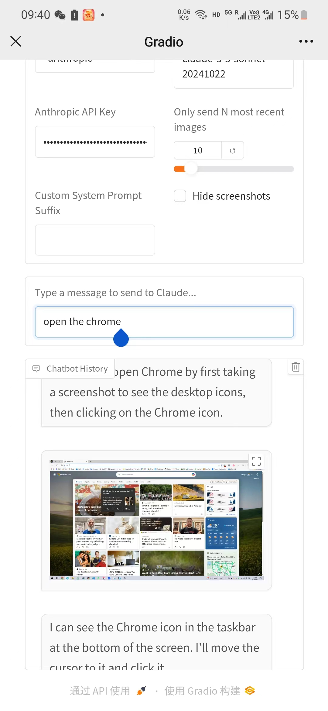

# Computer Use - OOTB

## 🌟 Overview
This is an out-of-the-box (OOTB) solution for Claude's new Computer Use APIs. 

**No Docker** is required, and it theoretically supports **any platform**, with testing currently done on **Windows**. This project provides a user-friendly interface based on Gradio. 🎨

## Update
- 10-25: Now you can **Remotely Control** your computer 💻 through your mobile device 📱 —**No App Installation** required! Give it a try and have fun 🎉.

## Demo Video

[](https://youtu.be/VH9bEUkdIAY)

## 🚀 Getting Started

### 0. Prerequisites
- Instal Miniconda on your system through this [link](https://www.anaconda.com/download?utm_source=anacondadocs&utm_medium=documentation&utm_campaign=download&utm_content=topnavalldocs). (Recommand Python Version: >= **3.11**).

### 1. Clone the Repository 📂
Open the Conda Terminal. (After installation Of Miniconda, it will appear in the Start menu.)
Run the following command on **Conda Terminal**.
```bash
git clone https://github.com/showlab/computer_use_ootb.git
cd computer_use_ootb
```

### 2. Install Dependencies 🔧
```bash
pip install -r dev-requirements.txt
```

### 3. Start the Interface ▶️
```bash
python app.py
```
If you successfully start the interface, you will see two URLs in the terminal:
```bash
* Running on local URL:  http://127.0.0.1:7860
* Running on public URL: https://xxxxxxxxxxxxxxxx.gradio.live
```

## 4. Control Your Computer with Any Device can Access the Internet
- **Computer to be controlled**: The one installed software.
- **Device Send Command**: The one opens the website.
  
Open the website at http://localhost:7860/ (if you're controlling the computer itself) or https://71xxxxxxxxxxxxxxx.gradio.live in your mobile browser for remote control.

Enter the Anthropic API key (you can obtain it through this [website](https://console.anthropic.com/settings/keys)), then give commands to let the AI perform your tasks.

Mobile Interface



Desktop Interface


## 🖥️ Supported Systems
- **Windows** ✅

## ⚠️ Risks
- **Potential Dangerous Operations by the Model**: The models' performance is still limited and may generate unintended or potentially harmful outputs. Recommend continuously monitoring the AI's actions. 
- **Cost Control Challenges**: Each task may cost a few dollars. We'll optimize this in the future. 💸

## 📅 Roadmap

- [ ] **Interface Design**
  - [x] **Support for Gradio** ✨
  - [ ] **Simpler Installation**
  - [ ] **More Features**... 🚀
- [ ] **Platform**
  - [x] **Windows** 🖥️
  - [ ] **Mac** 🍎
- [ ] **Support for More MLLMs**
  - [x] **Claude 3.5 Sonnet** 🎵
  - [ ] **GPT-4o**
  - [ ] **Qwen2-VL**
  - [ ] ...
- [ ] **Improved Prompting Strategy**
  - [ ] Optimize prompts for cost-efficiency. 💡


