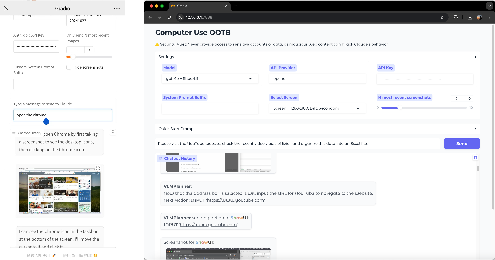

<h2 align="center">
    <a href="https://computer-use-ootb.github.io">
        
    </a>
</h2>


<h5 align="center"> If you like our project, please give us a star ⭐ on GitHub for the latest update.</h5>

<h5 align=center>

[](https://arxiv.org/abs/2411.10323)
[](https://computer-use-ootb.github.io)
[](https://hits.seeyoufarm.com/api/count/incr/badge.svg?url=https%3A%2F%2Fgithub.com%2Fshowlab%2Fcomputer_use_ootb&count_bg=%2379C83D&title_bg=%23555555&icon=&icon_color=%23E7E7E7&title=hits&edge_flat=false)


</h5>

##   Overview
**Computer Use <span style="color:rgb(106, 158, 210)">O</span><span style="color:rgb(111, 163, 82)">O</span><span style="color:rgb(209, 100, 94)">T</span><span style="color:rgb(238, 171, 106)">B</span>** is an out-of-the-box (OOTB) solution for Desktop GUI Agent, including API-based (**Claude 3.5 Computer Use**) and locally-running models (**<span style="color:rgb(106, 158, 210)">S</span><span style="color:rgb(111, 163, 82)">h</span><span style="color:rgb(209, 100, 94)">o</span><span style="color:rgb(238, 171, 106)">w</span>UI**). 

**No Docker** is required, and it supports both **Windows** and **macOS**. This project provides a user-friendly interface based on Gradio. 🎨

For more information, you can visit our study on Claude 3.5 Computer Use [[project page]](https://computer-use-ootb.github.io). 🌐

## Update
- **<span style="color:rgb(231, 183, 98)">Major Update!</span> [2024/11/27]** **Local Run🔥** is now live! Say hello to [**<span style="color:rgb(106, 158, 210)">S</span><span style="color:rgb(111, 163, 82)">h</span><span style="color:rgb(209, 100, 94)">o</span><span style="color:rgb(238, 171, 106)">w</span>UI**](https://github.com/showlab/ShowUI), a open-source 2B vision-language-action (VLA) model for GUI Agent. Now compatible with `"gpt-4o + ShowUI" (~200x cheaper)`*  & `"Qwen2-VL + ShowUI" (~30x cheaper)`* for only few cents for each task💰! <span style="color: grey; font-size: small;">*compared to Claude Computer Use</span>.
- **[2024/11/20]** We've added some examples to help you get hands-on experience with Claude 3.5 Computer Use.
- **[2024/11/19]** Forget about the single-display limit set by Anthropic - you can now use **multiple displays** 🎉!
- **[2024/11/18]** We've released a deep analysis of Claude 3.5 Computer Use: [https://arxiv.org/abs/2411.10323](https://arxiv.org/abs/2411.10323).
- **[2024/11/11]** Forget about the low-resolution display limit set by Anthropic — you can now use *any resolution you like* and still keep the **screenshot token cost low** 🎉!
- **[2024/11/11]** Now both **Windows** and **macOS** platforms are supported 🎉!
- **[2024/10/25]** Now you can **Remotely Control** your computer 💻 through your mobile device 📱 — **No Mobile App Installation** required! Give it a try and have fun 🎉.


## Demo Video

https://github.com/user-attachments/assets/f50b7611-2350-4712-af9e-3d31e30020ee

<div style="display: flex; justify-content: space-around;">
  <a href="https://youtu.be/Ychd-t24HZw" target="_blank" style="margin-right: 10px;">
    
  </a>
  <a href="https://youtu.be/cvgPBazxLFM" target="_blank">
    
  </a>
</div>


## 🚀 Getting Started

### 0. Prerequisites
- Instal Miniconda on your system through this [link](https://www.anaconda.com/download?utm_source=anacondadocs&utm_medium=documentation&utm_campaign=download&utm_content=topnavalldocs). (**Python Version: >= 3.11**).
- Hardware Requirements:
    - **Windows:** Must include CUDA, with a GPU memory greater than 6GB.
    - **Mac:** Processor must be M1 or higher, with a memory of at least 16GB.

### 1. Clone the Repository 📂
Open the Conda Terminal. (After installation Of Miniconda, it will appear in the Start menu.)
Run the following command on **Conda Terminal**.
```bash
git clone https://github.com/showlab/computer_use_ootb.git
cd computer_use_ootb
```

### 2.1 Install Dependencies 🔧
```bash
pip install -r dev-requirements.txt
```


### 2.2 (Optional) Get Prepared for **<span style="color:rgb(106, 158, 210)">S</span><span style="color:rgb(111, 163, 82)">h</span><span style="color:rgb(209, 100, 94)">o</span><span style="color:rgb(238, 171, 106)">w</span>UI** Local-Run

1. Download all files of the ShowUI-2B model via the following command. Ensure the `ShowUI-2B` folder is under the `computer_use_ootb` folder.

    ```python
    python install_showui.py
    ```

2. Make sure to install the correct GPU version of PyTorch (CUDA, MPS, etc.) on your machine. See [install guide and verification](https://pytorch.org/get-started/locally/).

3. Get API Keys for [GPT-4o](https://platform.openai.com/docs/quickstart) or [Qwen-VL](https://help.aliyun.com/zh/dashscope/developer-reference/acquisition-and-configuration-of-api-key). For mainland China users, Qwen API free trial for first 1 mil tokens is [available](https://help.aliyun.com/zh/dashscope/developer-reference/tongyi-qianwen-vl-plus-api).


### 3. Start the Interface ▶️

**Start the OOTB interface:**
```bash
python app.py
```
If you successfully start the interface, you will see two URLs in the terminal:
```bash
* Running on local URL:  http://127.0.0.1:7860
* Running on public URL: https://xxxxxxxxxxxxxxxx.gradio.live (Do not share this link with others, or they will be able to control your computer.)
```


> <u>For convenience</u>, we recommend running one or more of the following command to set API keys to the environment variables before starting the interface. Then you don’t need to manually pass the keys each run. On Windows: 
> ```bash
> $env:ANTHROPIC_API_KEY="sk-xxxxx" (Replace with your own key)
> $env:QWEN_API_KEY="sk-xxxxx"
> $env:OPENAI_API_KEY="sk-xxxxx"
> ```
> On macOS/Linux, replace `$env:ANTHROPIC_API_KEY` with `export ANTHROPIC_API_KEY` in the above command. 


### 4. Control Your Computer with Any Device can Access the Internet
- **Computer to be controlled**: The one installed software.
- **Device Send Command**: The one opens the website.
  
Open the website at http://localhost:7860/ (if you're controlling the computer itself) or https://xxxxxxxxxxxxxxxxx.gradio.live in your mobile browser for remote control.

Enter the Anthropic API key (you can obtain it through this [website](https://console.anthropic.com/settings/keys)), then give commands to let the AI perform your tasks.


<div style="display: flex; align-items: center; gap: 10px;">
  <figure style="text-align: center;">
    
  </figure>
</div>


## 🖥️ Supported Systems
- **Windows** (Claude ✅, ShowUI ✅)
- **macOS** (Claude ✅, ShowUI ✅)

## ⚠️ Risks
- **Potential Dangerous Operations by the Model**: The models' performance is still limited and may generate unintended or potentially harmful outputs. Recommend continuously monitoring the AI's actions. 
- **Cost Control**: Each task may cost a few dollars for Claude 3.5 Computer Use.💸

## 📅 Roadmap
- [ ] **Explore available features**
  - [ ] The Claude API seems to be unstable when solving tasks. We are investigating the reasons: resolutions, types of actions required, os platforms, or planning mechanisms. Welcome any thoughts or comments on it.
- [ ] **Interface Design**
  - [x] **Support for Gradio** ✨
  - [ ] **Simpler Installation**
  - [ ] **More Features**... 🚀
- [ ] **Platform**
  - [x] **Windows** 
  - [x] **Mobile** (Send command)
  - [x] **macOS**
  - [ ] **Mobile** (Be controlled)
- [ ] **Support for More MLLMs**
  - [x] **Claude 3.5 Sonnet** 🎵
  - [x] **GPT-4o**
  - [x] **Qwen2-VL**
  - [ ] ...
- [ ] **Improved Prompting Strategy**
  - [ ] Optimize prompts for cost-efficiency. 💡

## Join Discussion
Welcome to discuss with us and continuously improve the user experience of Computer Use - OOTB. Reach us using this [**Discord Channel**](https://discord.gg/HnHng5de) or the WeChat QR code below!

<div style="display: flex; flex-direction: row; justify-content: space-around;">


</div>

<div style="height: 30px;"></div>

<hr>
<a href="https://computer-use-ootb.github.io">

</a>


